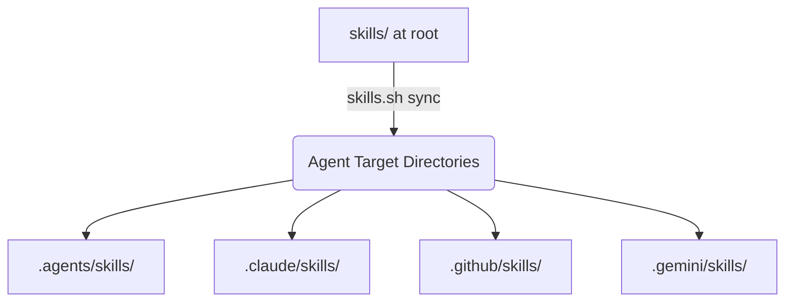
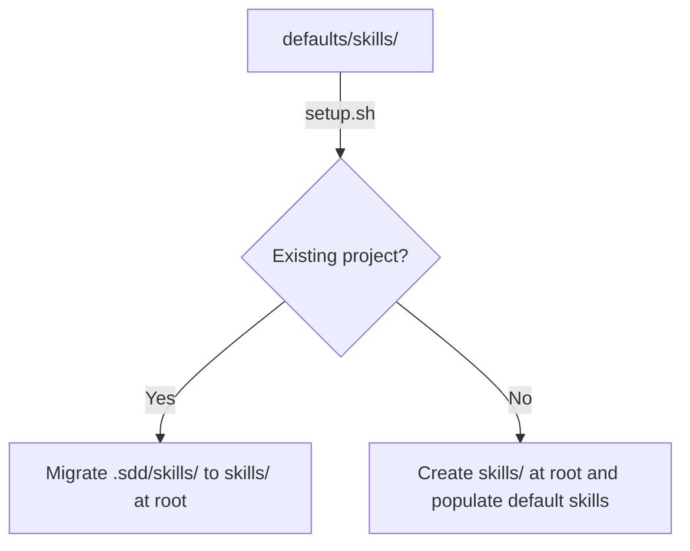

# Phase 002 - Skills Management - Design

**Phase:** Phase 002 - Skills Management  
**Created:** 2026-06-18  
**Status:** ✅ APPROVED  
**Requirements Approved:** ✅ YES (2026-06-18)  
**Approved:** 2026-06-18

---

## 🎯 Design Overview

This document specifies the technical implementation details for moving local agent skills out of the hidden `.sdd/` directory to a root-level `skills/` directory and implementing the new `scripts/skills.sh` CLI tool.

---

## 🏗️ Architecture & Flow Diagram

### Skill Sync Flow


### Installation/Setup Flow


---

## 🔧 Technology Stack Decisions

### REQ-002.1: Root-Level Skills Directory Support

**Decision: Root-level `skills/` folder**

**Rationale:**
- AI coding agents configured with `skills.sh` natively discover and parse `skills/<name>/SKILL.md` relative to the repository root.
- Relocating skills to the root makes the project structure cleaner and standardizes local capabilities.

**Migration Logic (implemented in `setup.sh`):**
```bash
if [[ -d ".sdd/skills" ]]; then
    echo "🔄 Migrating existing .sdd/skills/ to root skills/ directory..."
    mkdir -p "skills"
    # Copy files preserving permissions/structure
    cp -R .sdd/skills/* skills/
    # Delete old directory once migration is safe
    rm -rf .sdd/skills
fi
```

---

### REQ-002.2: CLI Helper Script (`scripts/skills.sh`)

**Decision: Bash script implementation**

**Rationale:**
- Native shell execution with zero dependencies (e.g. no Node.js dependency required to run the CLI helper).
- Easy to integrate directly with Git and filesystem tools.

**Command Implementations:**

#### 1. `list`
Scans `skills/` directory and parses the YAML frontmatter.
```bash
for skill_dir in skills/*; do
    if [[ -d "$skill_dir" && -f "$skill_dir/SKILL.md" ]]; then
        # Parse YAML frontmatter name and description
        local name=$(sed -n '/^---$/,/^---$/p' "$skill_dir/SKILL.md" | grep "^name:" | cut -d: -f2- | xargs)
        local desc=$(sed -n '/^---$/,/^---$/p' "$skill_dir/SKILL.md" | grep "^description:" | cut -d: -f2- | xargs)
        echo "⭐️ $name: $desc"
    fi
done
```

#### 2. `sync`
Copies or links files from `skills/` to target agent directories.
Supports `--dry-run` to print operations without executing.

#### 3. `create <name>`
Validates `<name>` matching `^[a-z0-9-]+$`.
Creates `skills/<name>/SKILL.md` with scaffolded frontmatter:
```markdown
---
name: <name>
description: A description of what <name> does.
---

# <name>

Instructions go here.
```

#### 4. `validate`
Ensures:
- Folder name is kebab-case.
- `SKILL.md` exists.
- Frontmatter begins/ends with `---`, contains `name` matching the folder name, and contains a non-empty `description`.

#### 5. `add <source> [--skill <name>]`
Enables adding skills from:
- A GitHub repo shorthand (`owner/repo` e.g., `vercel-labs/agent-skills`).
- A full GitHub URL.
- Copies the skill folder(s) to `./skills/`.

**Implementation details for Remote Add:**
```bash
# Clone remote repo into a temporary folder, copy the target skill, and clean up
temp_dir=$(mktemp -d)
git clone --depth 1 "https://github.com/$repo_owner/$repo_name.git" "$temp_dir" >/dev/null 2>&1
# Copy skill directory to ./skills/
cp -R "$temp_dir/skills/$skill_name" "./skills/"
rm -rf "$temp_dir"
```

---

## 📂 Directory Structure

```
spec-framework/
├── defaults/
│   └── skills/                  # Default skills (e.g., sdd-workflow)
├── skills/                      # Self-hosted skills for this repo
│   └── sdd-workflow/
│       └── SKILL.md
├── scripts/
│   ├── skills.sh                # [NEW] CLI helper
│   ├── sync-skills.sh           # [MODIFY] Backward compatibility wrapper
│   ├── setup.sh                 # [MODIFY] Handles migration and root skills
│   └── doctor.sh                # [MODIFY] Performs validation checks
```

---

## 🧪 Testing Strategy

### Automated Tests
- Running `bash scripts/doctor.sh` to verify structure checks pass on the updated repo.
- Run `bash scripts/skills.sh validate` to verify it catches structural issues (e.g., non-kebab-cased names, missing frontmatter).

### Manual Verification
1. Create a temporary project with `.sdd/skills/`, run `setup.sh`, and verify it migrates to root `skills/`.
2. Execute `scripts/skills.sh create test-cli-skill` and verify template contents.
3. Run `scripts/skills.sh list` to check formatting.
4. Run `scripts/skills.sh sync` and verify skills are populated in `.claude/skills/`, `.gemini/skills/`, etc.
5. Try `scripts/skills.sh add vercel-labs/agent-skills --skill react-best-practices` (or similar mock) to check remote fetching.

---

## ✅ Approval Checkpoint

**🛑 STOP - DO NOT PROCEED TO EXECUTION WITHOUT APPROVAL**

Please review the design and proceed with approval.
