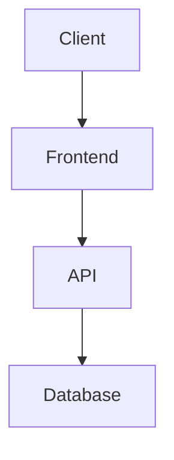

# System Architecture - [Project Name]

**Created:** [Date]  
**Status:** 📝 DRAFT

---

## 🏗️ High-Level Architecture

## 🔁 Data Flow
- [Describe request/response flow]
- [Describe async/event flow]

## 🔒 Security Boundaries
- [Where auth happens]
- [Where data is encrypted]

## 📦 Components
- Frontend: [App]
- Backend: [Service]
- Data: [DB/Storage]

---

## ✅ Approval Checkpoint

**🛑 STOP - DO NOT PROCEED TO IMPLEMENTATION WITHOUT APPROVAL**

**Please respond with:**
- ✅ "Approved"
- 🔄 "I have changes..."
- ❓ "I have questions..."
