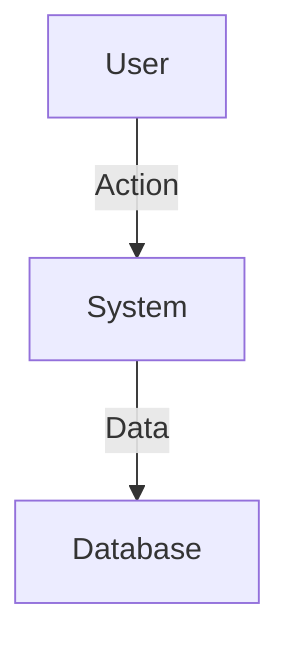

# [PHASE NAME] - Design

**Phase:** [Phase N] - [Name]  
**Created:** [Date]  
**Status:** 📝 DRAFT  
**Requirements Approved:** ✅ YES ([Date])  
**Approved:** [Date or Pending]

---

## 🎯 Design Overview

This document details **HOW** we will implement the Phase [N] requirements. It specifies:
- Exact technology choices
- Architecture and integration patterns
- Configuration details
- Directory structure
- Implementation approach

---

## 🏗️ Architecture Diagram



---

## 🔧 Technology Stack Decisions

### REQ-[N].1: [Related Requirement]

**Decision: [Technology/Pattern Choice]**

**Rationale:**
- **Reason 1**: [Explanation]
- **Reason 2**: [Explanation]

**Implementation Details:**
```python
# Pseudo-code or configuration example
def example():
    pass
```

---

### REQ-[N].2: [Related Requirement]

**Decision: [Technology/Pattern Choice]**

**Rationale:**
- **Reason 1**: [Explanation]

---

## 📂 Directory Structure

```
project-root/
├── src/
│   ├── components/
│   └── services/
└── tests/
```

---

## 🧪 Testing Strategy

**Unit Tests:**
- Scope: [What to test]
- Tools: [Framework]

**Integration Tests:**
- Scope: [What to test]

---

## ✅ Approval Checkpoint

**🛑 STOP - DO NOT PROCEED TO TASKS WITHOUT APPROVAL**

**Before proceeding, please confirm:**
1. Does this design technically feasible?
2. Does it satisfy all requirements?
3. Are the technology choices appropriate?

**Please respond with:**
- ✅ "Approved - proceed to Tasks"
- 🔄 "I have changes..." (specify changes)
- ❓ "I have questions..." (ask questions)

---

**Once approved, I will create the Tasks document detailing the implementation steps.**
