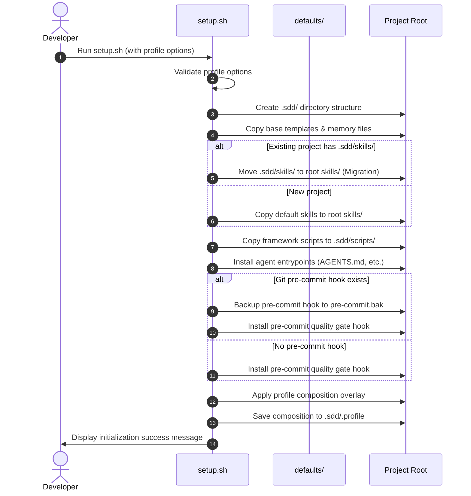
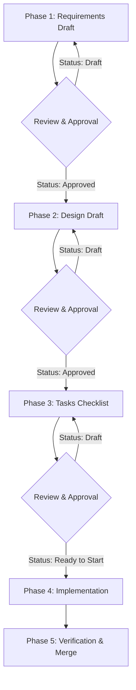
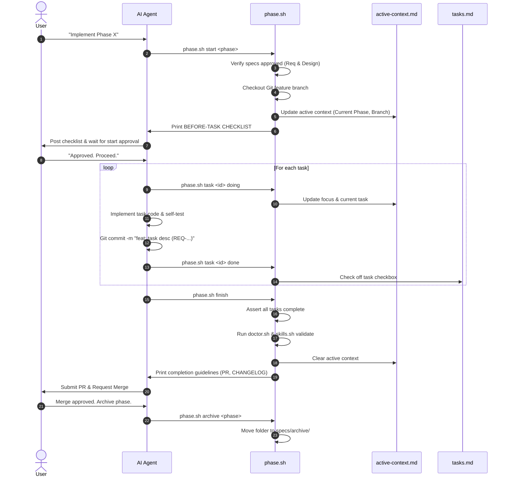
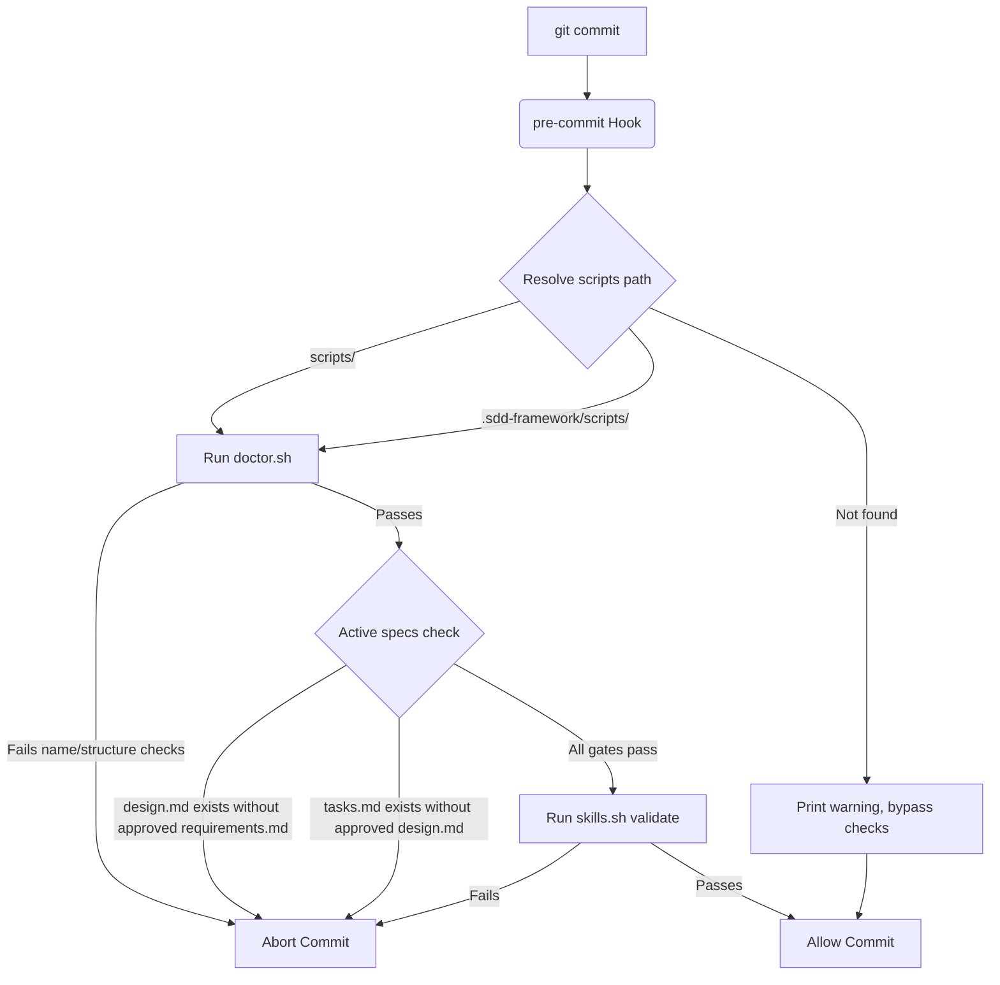
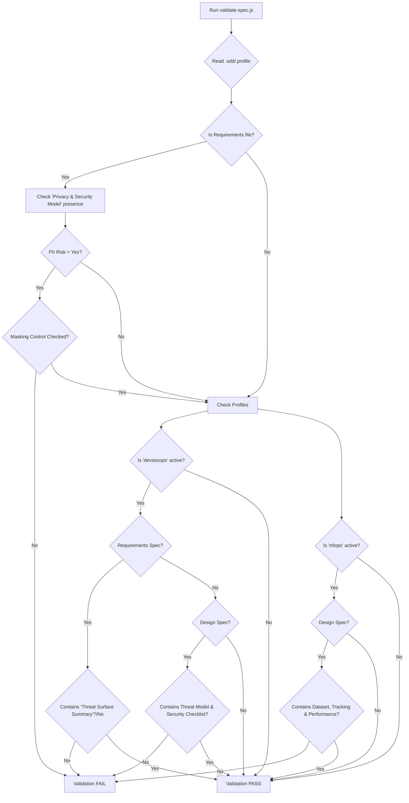

# SDD Framework - Process Flows & Life Cycles

This document outlines the operational process flows and lifecycles of the Spec-Driven Development (SDD) Framework using Mermaid diagrams.

---

## 1. Setup & Profile Composition Flow (`setup.sh`)

This flow describes the initialization process in a consumer project. It validates profiles, overlays files, configures Git hooks, and sets up agent entry points.

---

## 2. Active running Flow: The SDD Specification Lifecycle

Spec-Driven Development enforces sequential progression gates. A developer or agent cannot write design specifications without approved requirements, and cannot write execution tasks without approved design details.

---

## 3. Active Phase Sprint Hook Flow (`phase.sh`)

This flow details how the agent interacts with the `phase.sh` sprint runner tool during active implementation.

---

## 4. Git Pre-Commit Hook (Quality Gate)

This flow enforces SDD naming rules and file validations programmatically on every `git commit`.

---

## 5. Profile-Aware Spec Validation Flow (`validate-spec.js`)

This flow validates written specifications against the rules defined by the active profile composition.

