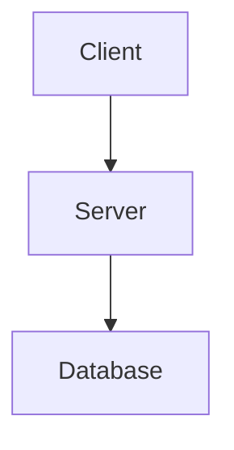

# Technical Design: [PHASE/FEATURE NAME]

**Version:** 1.0
**Status**: Planning

---

## 1. Architecture Overview

### System Components


### Component Interaction
[Description of how components talk to each other]

---

## 2. API Design

### Endpoint: `[METHOD] /path/to/resource`

#### Request Schema
```typescript
interface Request {
  field: string;
}
```

#### Response Schema
```typescript
interface Response {
  success: boolean;
  data: any;
}
```

---

## 3. Data Design

### Schema Definitions
```sql
-- SQL or JSON Schema
CREATE TABLE example (
  id uuid PRIMARY KEY,
  created_at timestamp
);
```

---

## 4. Logic & Algorithms

### [Algorithm Name]
```typescript
// Pseudocode or Interface
function calculate() {
  // Step 1
  // Step 2
}
```

---

## 5. Security & Reliability

### Security Controls
- **Auth**: [Method]
- **Validation**: [Libraries/Logic]

### Error Handling
- **Retry Logic**: [Strategy]
- **Fallbacks**: [Strategy]

---

## 6. Testing Strategy
- **Unit Tests**: [Components to test]
- **Integration Tests**: [Flows to test]
- **Performance Tests**: [Load targets]

### Test Types
- Unit Tests: [Scope]
- Integration Tests: [Scope]
- Contract Tests: [Scope]

### Coverage Strategy
- Target Coverage: [Percentage]
- Critical Paths: [What must be covered]

### Test Data
- Fixtures: [Where stored]
- Seed Scripts: [Location]

---

## Migration & Deployment

### Migration Plan
1. Step 1: [description]
2. Step 2: [description]
3. Step 3: [description]

### Deployment Steps
- Deploy Sequence: [CI/CD steps]
- Rollback Plan: [How to revert]
- Feature Flags: [Usage]

### Infrastructure as Code
- Terraform/K8s Files: [Paths]
- Config Files: [Paths]

---

## Risks & Mitigations

| Risk | Impact | Likelihood | Mitigation |
|------|--------|------------|------------|
| [Risk 1] | High | Medium | [Plan] |
| [Risk 2] | Medium | Low | [Plan] |

---

## Open Questions & Dependencies

### Open Questions
- [Question 1]
- [Question 2]

### Dependencies
- [Dependency 1]
- [Dependency 2]

---

## Constitutional Compliance Checklist

### Article I: DevSecOps First
- [ ] Security controls defined
- [ ] Observability plan documented
- [ ] Infrastructure codified

### Article II: Spec-Driven Development
- [ ] Design addresses all requirements
- [ ] Traceability maintained
- [ ] Review required before tasks

### Article III: Test-First Development
- [ ] Test strategy defined
- [ ] Coverage targets documented
- [ ] TDD workflow feasible

### Article IV: Event-Driven Architecture
- [ ] Events designed (if applicable)
- [ ] Event schemas defined
- [ ] Consumer handling documented

### Article V: MCP-Enabled Intelligence
- [ ] MCP endpoints designed (if applicable)
- [ ] Context resources defined
- [ ] Prompt/Tool design outlined

---

## Review & Approval

### Design Review Checklist
- [ ] Addresses every functional requirement
- [ ] Covers performance & security requirements
- [ ] Includes deployment & rollback plan
- [ ] Defines complete testing strategy
- [ ] Identifies risks & mitigations

### Approval
- [ ] **APPROVED BY**: [Name/Role] on [DATE]
- [ ] Ready for Task Breakdown (`tasks.md`)

---

**Next Step**: Break this design into implementable tasks (`tasks.md`).
