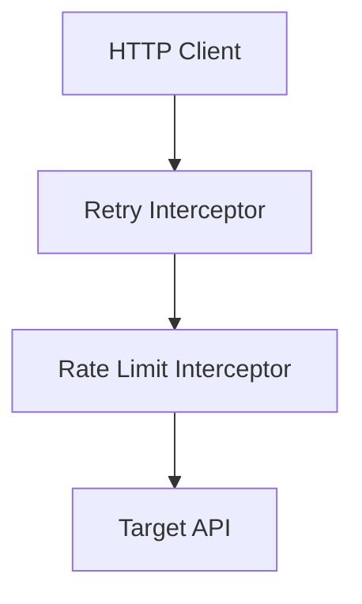

# API Integration — Design

**Phase:** Phase 002 — API Integration  
**Status:** ✅ APPROVED  

## D002.1: HTTP Client Architecture
**Requirements:** REQ-002.1, REQ-002.2

Uses a modular client with interceptors for retry and backoff logic.

